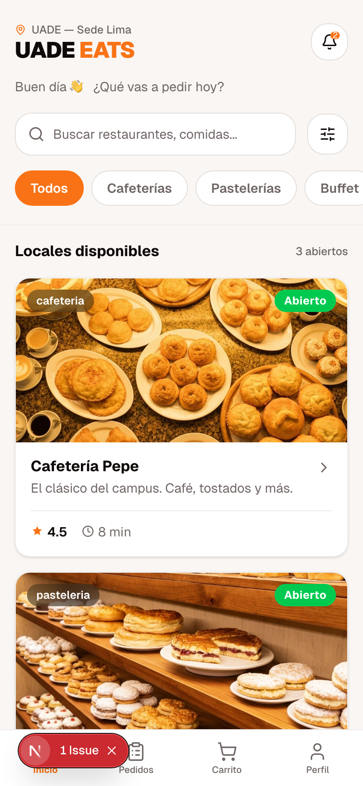
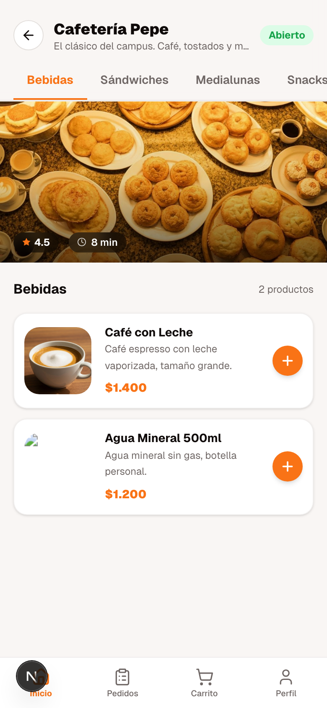
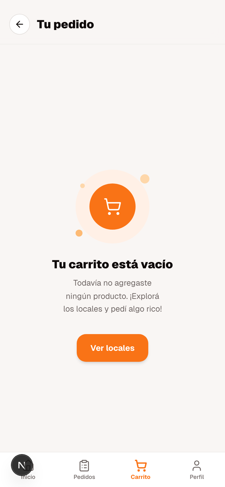
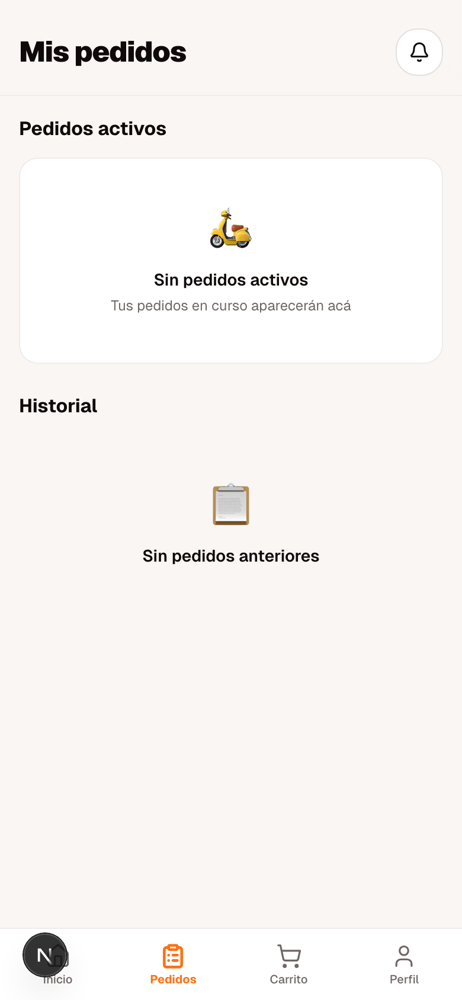
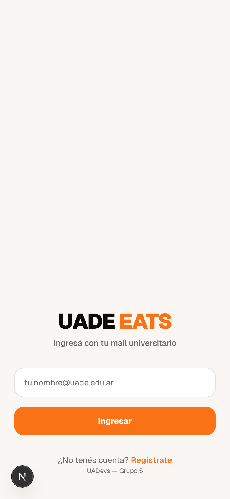
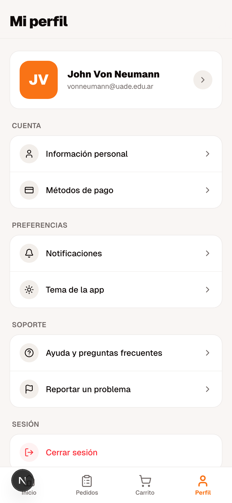
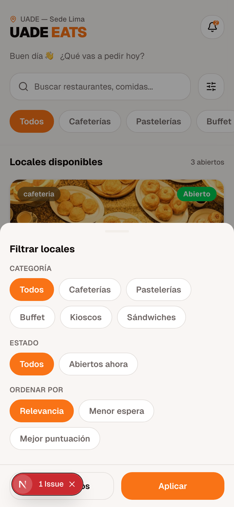
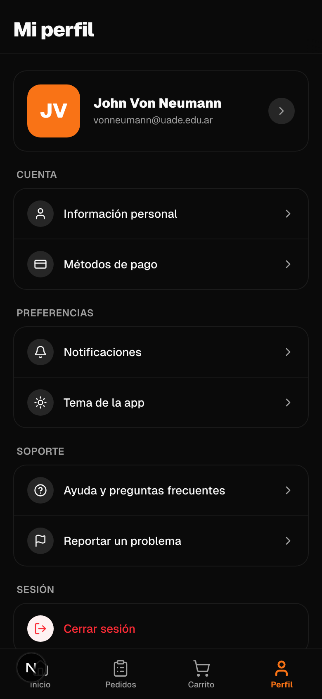

<div align="center">

# UADE EATS

**Campus food ordering app for UADE University**

A mobile-first web app that lets students and staff browse on-campus cafeterias, add items to a cart, and place pickup orders — all from their phone.

[](https://nextjs.org)
[](https://react.dev)
[](https://www.typescriptlang.org)
[](https://tailwindcss.com)

</div>

---

## Screenshots

<div align="center">

| Home | Store | Cart | Checkout |
|:----:|:-----:|:----:|:--------:|
|  |  |  |  |

| Login | Profile | Filters | Dark Mode |
|:-----:|:-------:|:-------:|:---------:|
|  |  |  |  |

</div>

---

## Tech Stack

| Category | Technology |
|---|---|
| Framework | Next.js 16 (App Router) |
| Language | TypeScript 5.7 |
| UI Library | Shadcn/ui · Radix UI |
| Styling | Tailwind CSS v4 · CSS custom properties |
| Forms | React Hook Form · Zod |
| State | Context API + `useReducer` |
| Icons | Lucide React |
| Notifications | Sonner |
| Theming | next-themes (light / dark) |
| Runtime | Node.js · pnpm |

---

## Features

- **Store discovery** — browse on-campus venues with search, category tabs, and advanced filters (category, status, sort order)
- **Product catalog** — per-store product listing organized by category with images and descriptions
- **Shopping cart** — add/remove items, adjust quantities, and see a live order summary
- **Order flow** — checkout confirmation and order history with real-time status tracking
- **Authentication** — email-based login restricted to `@uade.edu.ar` domain
- **User profile** — personal info, payment methods, and notification preferences
- **Dark / light theme** — full theme support via CSS custom properties and class toggling
- **Vendor view** — separate interface for store operators to manage incoming orders

---

## Architecture & Design Decisions

### Mobile-first layout
The app targets a 480 px max-width container centered on screen, simulating a native phone app experience in the browser. Every interaction — navigation, modals, drawers — is designed around one-thumb reachability.

### Design system
Built on **Shadcn/ui** (New York style) over **Radix UI** headless primitives. The full component library (~40 components) lives in `components/ui/` and can be customized without touching third-party source.

**Brand tokens:**

| Token | Value |
|---|---|
| Primary orange | `#F97316` |
| Light surface | `#F9F5F0` |
| Dark base | `#1C1917` |

Colors are defined as `oklch()` CSS variables, making dark mode a zero-JavaScript swap via a single `.dark` class on `<html>`.

### State management
Global state (auth, cart, orders, notifications) is managed with **Context API + `useReducer`** — no external library needed at this scale. State is persisted across page reloads via cookies and `localStorage`.

### Data layer
All data is currently mocked in `lib/mock-data.ts` (stores, products, users). API integration points are marked with `TODO` comments throughout the codebase, making it straightforward to swap in a real backend.

---

## Project Structure

```
v0-uade-eats/
├── app/                    # Next.js App Router pages
│   ├── page.tsx            # Home — store listing
│   ├── store/              # Product catalog
│   ├── cart/               # Shopping cart
│   ├── checkout/           # Order confirmation
│   ├── orders/             # Order history
│   ├── profile/            # Settings (7 sub-pages)
│   ├── login/              # Authentication
│   ├── register/           # Sign up
│   └── vendor/             # Vendor dashboard
├── components/
│   ├── ui/                 # Shadcn/ui component library (~40 components)
│   └── *.tsx               # Feature components (cart, search, filters…)
├── context/
│   └── AppContext.tsx       # Global state — auth, cart, orders, notifications
├── lib/
│   ├── types.ts            # TypeScript interfaces
│   ├── mock-data.ts        # Mock stores, products, users
│   └── utils.ts            # cn() and helpers
└── public/
    ├── images/             # Store and product photos
    └── screenshots/        # App screenshots (used in this README)
```

---

## Getting Started

**Prerequisites:** Node.js ≥ 22 · pnpm

```bash
# Clone
git clone https://github.com/valentinnavalos/v0-uade-eats.git
cd v0-uade-eats

# Install
pnpm install

# Dev server → http://localhost:3000
pnpm dev
```

**Test credentials:** `vonneumann@uade.edu.ar` (any input is accepted on the login form with a valid `@uade.edu.ar` address)

| Command | Description |
|---|---|
| `pnpm dev` | Start development server |
| `pnpm build` | Production build |
| `pnpm start` | Start production server |
| `pnpm lint` | Run ESLint |

---

## Roadmap

- [ ] REST API integration (replace mock data)
- [ ] Real authentication (JWT / OAuth)
- [ ] Payment gateway integration
- [ ] Dark mode toggle (CSS is ready, UI wiring pending)
- [ ] Push notifications
- [ ] Order tracking with live status updates

---

<div align="center">

Academic project.

Made for **Seminario de Integración Profesional** · UADevs Grupo 5 · UADE

</div>
